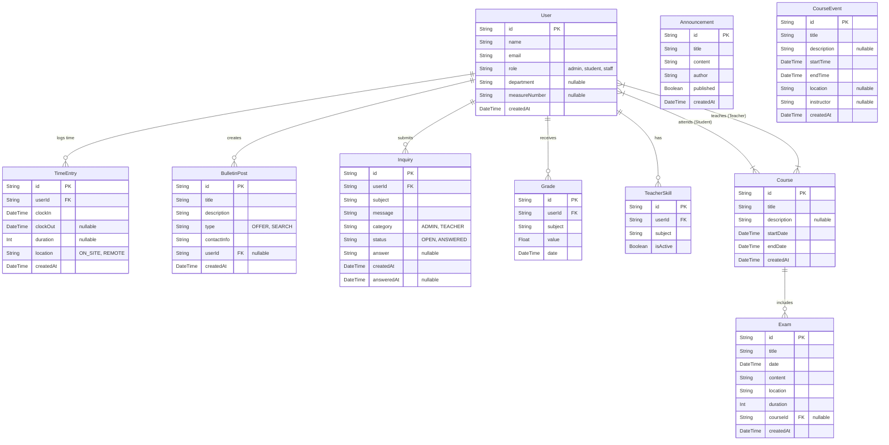

# Schul-Portal-Demo - Technical Documentation

## 🚀 Features for Future Planning

The following features and improvements are planned for upcoming iterations of the Schul-Portal-Demo. These aim to enhance scalability, user experience, and administrative control.

### 1. 🏗️ Architecture & Database Redesign
*   **Database Schema Optimization:** Re-evaluate existing relationships to reduce redundancy and support more complex query patterns (e.g., historical tracking of grade changes).
*   **Performance Tuning:** Implement database indexing strategies and analyze query performance to prevent bottlenecks as data volume grows.
*   **Scalability Check:** Ensure the database design can handle a significant increase in concurrent users and data entries over the next 2-3 years.

### 2. 🎨 UI/UX Overhaul
*   **Modern Design Language:** Refresh the user interface with a more cohesive and accessible design system, ensuring consistent spacing, typography, and color usage.
*   **Mobile Responsiveness:** rigorously test and improve mobile layouts for all roles, ensuring seamless usage on smartphones and tablets.
*   **Accessibility (a11y):** Audit the entire application for WCAG 2.1 compliance to support users with disabilities (screen readers, keyboard navigation).

### 3. 🧪 Comprehensive Testing Strategy
*   **Expanded Test Coverage:** Move beyond basic unit tests to include integration and end-to-end (E2E) tests covering critical user flows.
*   **Edge Case Scenarios:** specifically target edge cases in role-based access and data validation.
*   **Automated Regression Testing:** Implement CI/CD pipelines that run comprehensive test suites on every pull request to prevent regressions.

### 4. 📂 Document Management System (DMS) / File Uploads
*   **Teacher Resources:** Enable teachers to upload lecture notes, slides, and supplementary materials directly to their courses.
    *   *Non-Technical Guide:* Create a simple, drag-and-drop interface with clear instructions (e.g., "Drag your PDF here") to minimize friction for non-technical staff.
*   **Student Assignments:** Allow students to upload homework and project files directly to specific course modules.
*   **CMS Integration:** Consider integrating a lightweight Headless CMS (like Strapi or Contentful) or building a dedicated DMS module for handling file versioning and permissions.

### 5. 💬 Enhanced Course Interaction
*   **Course Comments/Announcements:** Add a "Teacher's Board" to each course where instructors can post updates, tech stack details (e.g., "We will use React 19 & Tailwind"), or last-minute changes.
*   **Tech Stack Specification:** Allow teachers to define the specific technologies used in a course module (e.g., version numbers, required software) visible in the course overview.

### 6. 🛠️ Advanced Admin Support Tools
*   **Impersonation Mode:** Allow admins to "view as" a specific user to troubleshoot issues exactly as the user sees them.
*   **Audit Logs:** Implement detailed logging of all administrative actions (who changed what and when) for security and accountability.
*   **System Health Dashboard:** visual real-time metrics for server load, database connections, and error rates.

### 7. 📌 Bulletin Board Enhancements
*   **Expiration Management:** Users can set an expiration date (3, 7, 14, 30 days) for their posts. Expired posts are visually distinguished (grayed out) or automatically archived.
*   **Search & Filter:** Advanced filtering by "Search" vs "Offer" and full-text search for post content.

---

## 1. Technical Implementation

This project is a modern intranet application built with **Next.js 15**, utilizing the App Router and Server Actions for a seamless full-stack experience. The system is designed to handle role-based access control (RBAC) for Students, Teachers, Staff, and Administrators.

### Core Stack
*   **Framework:** [Next.js 15](https://nextjs.org/) (App Router, Server Components)
*   **Language:** TypeScript
*   **Database:** PostgreSQL (via Prisma ORM)
*   **Authentication:** Custom JWT-based auth with secure cookie handling (stateless)
*   **UI Library:** [Tailwind CSS](https://tailwindcss.com/) + [shadcn/ui](https://ui.shadcn.com/)
*   **Icons:** Lucide React

### Key Concepts
*   **Server Actions:** Used for all data mutations (login, creating users, posting inquiries). This eliminates the need for a separate API layer for internal features.
*   **Middleware:** `middleware.ts` handles route protection, ensuring users can only access pages relevant to their role (e.g., `/admin` is locked for Students).
*   **Prisma ORM:** Provides type-safe database access. The schema is defined in `prisma/schema.prisma`.

---

## 2. Architecture

### Database Schema (ER Diagram)

### Git & Deployment Workflow

1.  **Development:** Features are developed in local branches.
2.  **Prisma Migration:** Database changes are applied via `npx prisma migrate dev`.
3.  **Build:** `npm run build` generates the production bundle.
4.  **Start:** `npm start` launches the optimized production server.

---

## 3. Critical Evaluation

### Code Quality & Architecture
*   **Strengths:**
    *   **Modular:** Components are well-separated (e.g., `sidebar.tsx`, `create-inquiry-dialog.tsx`).
    *   **Type-Safe:** TypeScript is used consistently, reducing runtime errors.
    *   **Secure:** Server Actions automatically handle CSRF protection; Middleware enforces auth rules.
*   **Weaknesses:**
    *   **Complexity:** Some server components mix data fetching and UI logic too tightly.
    *   **State Management:** Heavy reliance on local state (`useState`) in some complex forms could be improved with URL state or a global store if the app grows.

### Bottlenecks & Technical Debt
*   **Database Queries:** Some dashboard views might trigger N+1 query issues (e.g., fetching students then their time entries individually).
    *   *Fix:* Optimize Prisma queries using `include` or raw SQL for complex reports.
*   **Role Logic:** Role-based rendering is often done with simple `if` checks in JSX.
    *   *Fix:* Abstraction into `<RoleGuard role="admin">` components would be cleaner.

### Proposed Improvements
1.  **Refactoring:** Extract complex data fetching into dedicated "Service" files (e.g., `lib/services/user-service.ts`).
2.  **Performance:** Implement React `Suspense` for slow-loading dashboard widgets.
3.  **Testing:** Add E2E tests with Playwright to verify critical flows like "Login" and "Clock In".

---

## 4. Learnings

*   **Why Server Actions?** They simplify the mental model by keeping backend logic right next to the UI that triggers it, reducing context switching.
*   **Managing Roles:** Hardcoding roles (`if role === 'admin'`) is easy to start with but gets messy. A robust permission system (RBAC) would be better for scaling.
*   **Shadcn/UI:** While powerful, it requires "owning" the code. Customizing components takes more effort than using a pre-styled library like Bootstrap, but offers way more control.
