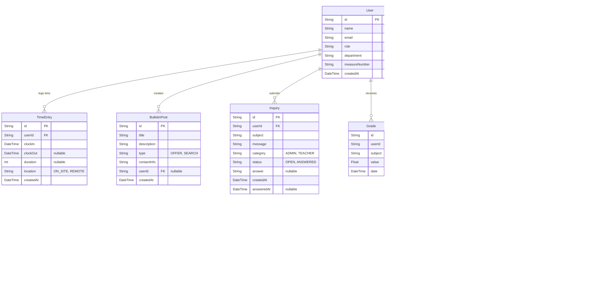

# VIBE Portal - Technical Documentation

## 1. Technical Implementation

This project is a modern intranet application built with **Next.js 15**, utilizing the App Router and Server Actions for a seamless full-stack experience. The system is designed to handle role-based access control (RBAC) for Students, Teachers, Staff, and Administrators.

### Core Stack
*   **Framework:** [Next.js 15](https://nextjs.org/) (App Router, Server Components)
*   **Language:** TypeScript
*   **Database:** PostgreSQL (via Prisma ORM)
*   **Authentication:** Custom JWT-based auth with secure cookie handling (stateless)
*   **UI Library:** [Tailwind CSS](https://tailwindcss.com/) + [shadcn/ui](https://ui.shadcn.com/)
*   **Icons:** Lucide React

### Key Concepts
*   **Server Actions:** Used for all data mutations (login, creating users, posting inquiries). This eliminates the need for a separate API layer for internal features.
*   **Middleware:** `middleware.ts` handles route protection, ensuring users can only access pages relevant to their role (e.g., `/admin` is locked for Students).
*   **Prisma ORM:** Provides type-safe database access. The schema is defined in `prisma/schema.prisma`.

---

## 2. Architecture

### Database Schema (ER Diagram)

### Git & Deployment Workflow

1.  **Development:** Features are developed in local branches.
2.  **Prisma Migration:** Database changes are applied via `npx prisma migrate dev`.
3.  **Build:** `npm run build` generates the production bundle.
4.  **Start:** `npm start` launches the optimized production server.

---

## 3. Critical Evaluation

### Code Quality & Architecture
*   **Strengths:**
    *   **Modular:** Components are well-separated (e.g., `sidebar.tsx`, `create-inquiry-dialog.tsx`).
    *   **Type-Safe:** TypeScript is used consistently, reducing runtime errors.
    *   **Secure:** Server Actions automatically handle CSRF protection; Middleware enforces auth rules.
*   **Weaknesses:**
    *   **Complexity:** Some server components mix data fetching and UI logic too tightly.
    *   **State Management:** Heavy reliance on local state (`useState`) in some complex forms could be improved with URL state or a global store if the app grows.

### Bottlenecks & Technical Debt
*   **Database Queries:** Some dashboard views might trigger N+1 query issues (e.g., fetching students then their time entries individually).
    *   *Fix:* Optimize Prisma queries using `include` or raw SQL for complex reports.
*   **Role Logic:** Role-based rendering is often done with simple `if` checks in JSX.
    *   *Fix:* Abstraction into `<RoleGuard role="admin">` components would be cleaner.

### Proposed Improvements
1.  **Refactoring:** Extract complex data fetching into dedicated "Service" files (e.g., `lib/services/user-service.ts`).
2.  **Performance:** Implement React `Suspense` for slow-loading dashboard widgets.
3.  **Testing:** Add E2E tests with Playwright to verify critical flows like "Login" and "Clock In".

---

## 4. Learnings

*   **Why Server Actions?** They simplify the mental model by keeping backend logic right next to the UI that triggers it, reducing context switching.
*   **Managing Roles:** Hardcoding roles (`if role === 'admin'`) is easy to start with but gets messy. A robust permission system (RBAC) would be better for scaling.
*   **Shadcn/UI:** While powerful, it requires "owning" the code. Customizing components takes more effort than using a pre-styled library like Bootstrap, but offers way more control.
