# Schul-Portal-Demo - Technische Dokumentation

## 🚀 Features für zukünftige Planung

Die folgenden Funktionen und Verbesserungen sind für kommende Iterationen des Schul-Portal-Demo geplant. Diese zielen darauf ab, Skalierbarkeit, Benutzererfahrung und administrative Kontrolle zu verbessern.

### 1. 🏗️ Architektur- & Datenbank-Redesign
*   **Datenbankschema-Optimierung:** Bestehende Beziehungen neu bewerten, um Redundanzen zu reduzieren und komplexere Abfragemuster zu unterstützen (z. B. historische Verfolgung von Notenänderungen).
*   **Performance-Tuning:** Implementierung von Datenbank-Indizierungsstrategien und Analyse der Abfrageleistung, um Engpässe bei steigendem Datenvolumen zu vermeiden.
*   **Skalierbarkeits-Check:** Sicherstellen, dass das Datenbankdesign einen signifikanten Anstieg gleichzeitiger Benutzer und Dateneinträge in den nächsten 2-3 Jahren bewältigen kann.

### 2. 🎨 UI/UX Überarbeitung
*   **Moderne Designsprache:** Aktualisierung der Benutzeroberfläche mit einem kohärenteren und zugänglicheren Designsystem, das konsistente Abstände, Typografie und Farbgebung gewährleistet.
*   **Mobile Responsivität:** Gründliches Testen und Verbessern der mobilen Layouts für alle Rollen, um eine nahtlose Nutzung auf Smartphones und Tablets sicherzustellen.
*   **Barrierefreiheit (a11y):** Audit der gesamten Anwendung auf WCAG 2.1-Konformität, um Benutzer mit Behinderungen zu unterstützen (Screenreader, Tastaturnavigation).

### 3. 🧪 Umfassende Teststrategie
*   **Erweiterte Testabdeckung:** Über einfache Unit-Tests hinausgehen und Integration- sowie End-to-End (E2E)-Tests einbeziehen, die kritische Benutzerabläufe abdecken.
*   **Edge-Case-Szenarien:** Gezieltes Testen von Grenzfällen bei rollenbasierter Zugriffskontrolle und Datenvalidierung.
*   **Automatisierte Regressionstests:** Implementierung von CI/CD-Pipelines, die umfassende Testsuiten bei jedem Pull Request ausführen, um Regressionen zu verhindern.

### 4. 📂 Dokumentenmanagementsystem (DMS) / Datei-Uploads
*   **Lehrer-Ressourcen:** Lehrern ermöglichen, Vorlesungsnotizen, Folien und ergänzende Materialien direkt in ihre Kurse hochzuladen.
    *   *Nicht-technischer Leitfaden:* Erstellung einer einfachen Drag-and-Drop-Schnittstelle mit klaren Anweisungen (z. B. "Ziehen Sie Ihr PDF hierher"), um Hürden für nicht-technisches Personal zu minimieren.
*   **Schüler-Hausaufgaben:** Schülern erlauben, Hausaufgaben und Projektdateien direkt in spezifische Kursmodule hochzuladen.
*   **CMS-Integration:** Überlegung zur Integration eines leichtgewichtigen Headless CMS (wie Strapi oder Contentful) oder Aufbau eines dedizierten DMS-Moduls zur Verwaltung von Dateiversionierung und Berechtigungen.

### 5. 💬 Erweiterte Kursinteraktion
*   **Kurskommentare/Ankündigungen:** Hinzufügen eines "Lehrer-Boards" zu jedem Kurs, auf dem Dozenten Updates, Details zum Tech-Stack (z. B. "Wir werden React 19 & Tailwind verwenden") oder kurzfristige Änderungen posten können.
*   **Tech-Stack-Spezifikation:** Lehrern ermöglichen, die spezifischen Technologien zu definieren, die in einem Kursmodul verwendet werden (z. B. Versionsnummern, erforderliche Software), sichtbar in der Kursübersicht.

### 6. 🛠️ Erweiterte Admin-Support-Tools
*   **Impersonation-Modus:** Admins erlauben, das System "als" ein bestimmter Benutzer zu sehen, um Probleme genau so zu beheben, wie der Benutzer sie sieht.
*   **Audit-Logs:** Implementierung einer detaillierten Protokollierung aller administrativen Aktionen (wer hat was wann geändert) für Sicherheit und Rechenschaftspflicht.
*   **System-Health-Dashboard:** Visuelle Echtzeit-Metriken für Serverauslastung, Datenbankverbindungen und Fehlerraten.

---

## 1. Technische Implementierung

Dieses Projekt ist eine moderne Intranet-Anwendung, die mit **Next.js 15** erstellt wurde und den App Router sowie Server Actions für ein nahtloses Full-Stack-Erlebnis nutzt. Das System ist für rollenbasierte Zugriffskontrolle (RBAC) für Schüler, Lehrer, Mitarbeiter und Administratoren ausgelegt.

### Kern-Stack
*   **Framework:** [Next.js 15](https://nextjs.org/) (App Router, Server Components)
*   **Sprache:** TypeScript
*   **Datenbank:** PostgreSQL (via Prisma ORM)
*   **Authentifizierung:** Benutzerdefinierte JWT-basierte Auth mit sicherer Cookie-Verarbeitung (stateless)
*   **UI-Bibliothek:** [Tailwind CSS](https://tailwindcss.com/) + [shadcn/ui](https://ui.shadcn.com/)
*   **Icons:** Lucide React

### Schlüsselkonzepte
*   **Server Actions:** Werden für alle Datenmutationen verwendet (Login, Benutzer erstellen, Anfragen senden). Dies eliminiert die Notwendigkeit einer separaten API-Schicht für interne Funktionen.
*   **Middleware:** `middleware.ts` handhabt den Routenschutz und stellt sicher, dass Benutzer nur auf Seiten zugreifen können, die für ihre Rolle relevant sind (z. B. ist `/admin` für Schüler gesperrt).
*   **Prisma ORM:** Bietet typsicheren Datenbankzugriff. Das Schema ist in `prisma/schema.prisma` definiert.

---

## 2. Architektur

### Datenbankschema (ER-Diagramm)

```mermaid
erDiagram
    User ||--o{ TimeEntry : "protokolliert Zeit"
    User ||--o{ BulletinPost : "erstellt"
    User ||--o{ Inquiry : "reicht ein"
    User ||--o{ Grade : "erhält"
    User ||--o{ TeacherSkill : "hat"
    User }|--|{ Course : "besucht (Schüler)"
    User }|--|{ Course : "lehrt (Lehrer)"
    Course ||--o{ Exam : "beinhaltet"
    
    User {
        String id PK
        String name
        String email
        String role "admin, student, staff"
        String department "nullable"
        String measureNumber "nullable"
        DateTime createdAt
    }

    Course {
        String id PK
        String title
        String description "nullable"
        DateTime startDate
        DateTime endDate
        DateTime createdAt
    }

    TimeEntry {
        String id PK
        String userId FK
        DateTime clockIn
        DateTime clockOut "nullable"
        Int duration "nullable"
        String location "ON_SITE, REMOTE"
        DateTime createdAt
    }

    Announcement {
        String id PK
        String title
        String content
        String author
        Boolean published
        DateTime createdAt
    }

    CourseEvent {
        String id PK
        String title
        String description "nullable"
        DateTime startTime
        DateTime endTime
        String location "nullable"
        String instructor "nullable"
        DateTime createdAt
    }

    BulletinPost {
        String id PK
        String title
        String description
        String type "OFFER, SEARCH"
        String contactInfo
        String userId FK "nullable"
        DateTime createdAt
    }

    Exam {
        String id PK
        String title
        DateTime date
        String content
        String location
        Int duration
        String courseId FK "nullable"
        DateTime createdAt
    }

    Inquiry {
        String id PK
        String userId FK
        String subject
        String message
        String category "ADMIN, TEACHER"
        String status "OPEN, ANSWERED"
        String answer "nullable"
        DateTime createdAt
        DateTime answeredAt "nullable"
    }

    Grade {
        String id PK
        String userId FK
        String subject
        Float value
        DateTime date
    }

    TeacherSkill {
        String id PK
        String userId FK
        String subject
        Boolean isActive
    }
```

### Git & Deployment Workflow

1.  **Entwicklung:** Features werden in lokalen Branches entwickelt.
2.  **Prisma Migration:** Datenbankänderungen werden via `npx prisma migrate dev` angewendet.
3.  **Build:** `npm run build` generiert das Produktions-Bundle.
4.  **Start:** `npm start` startet den optimierten Produktionsserver.

---

## 3. Kritische Evaluation

### Code-Qualität & Architektur
*   **Stärken:**
    *   **Modular:** Komponenten sind gut getrennt (z. B. `sidebar.tsx`, `create-inquiry-dialog.tsx`).
    *   **Typsicher:** TypeScript wird konsequent verwendet, was Laufzeitfehler reduziert.
    *   **Sicher:** Server Actions handhaben automatisch CSRF-Schutz; Middleware erzwingt Auth-Regeln.
*   **Schwächen:**
    *   **Komplexität:** Einige Server Components vermischen Datenabruf und UI-Logik zu stark.
    *   **State Management:** Starke Abhängigkeit von lokalem State (`useState`) in einigen komplexen Formularen könnte durch URL-State oder einen globalen Store verbessert werden, wenn die App wächst.

### Engpässe & Technische Schulden
*   **Datenbankabfragen:** Einige Dashboard-Ansichten könnten N+1-Abfrageprobleme auslösen (z. B. Abrufen von Schülern und dann deren Zeiteinträge einzeln).
    *   *Lösung:* Optimierung von Prisma-Abfragen mit `include` oder Raw SQL für komplexe Berichte.
*   **Rollen-Logik:** Rollenbasiertes Rendering erfolgt oft durch einfache `if`-Prüfungen in JSX.
    *   *Lösung:* Abstraktion in `<RoleGuard role="admin">`-Komponenten wäre sauberer.

### Vorgeschlagene Verbesserungen
1.  **Refactoring:** Extrahieren komplexer Datenabrufe in dedizierte "Service"-Dateien (z. B. `lib/services/user-service.ts`).
2.  **Performance:** Implementierung von React `Suspense` für langsam ladende Dashboard-Widgets.
3.  **Testing:** Hinzufügen von E2E-Tests mit Playwright zur Überprüfung kritischer Abläufe wie "Login" und "Clock In".

---

## 4. Learnings

*   **Warum Server Actions?** Sie vereinfachen das mentale Modell, indem sie die Backend-Logik direkt neben der UI halten, die sie auslöst, was den Kontextwechsel reduziert.
*   **Rollen verwalten:** Hardcodierte Rollen (`if role === 'admin'`) sind einfach für den Anfang, werden aber unübersichtlich. Ein robustes Berechtigungssystem (RBAC) wäre besser für die Skalierung.
*   **Shadcn/UI:** Obwohl mächtig, erfordert es, den Code zu "besitzen". Das Anpassen von Komponenten erfordert mehr Aufwand als die Verwendung einer vorgefertigten Bibliothek wie Bootstrap, bietet aber viel mehr Kontrolle.
