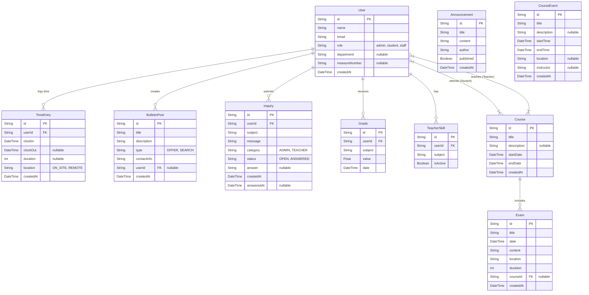

# Entity Plan & Database Schema Analysis

This document outlines the database schema for the Intranet application, detailing entities, their attributes, relationships, and user capabilities.

## Visual Representation (Mermaid)

## Entity Descriptions

### 1. User
**Description**: Represents all actors in the system (Students, Teachers, Administrators, Staff).
**Attributes**:
*   `role`: Defines permissions (`admin`, `student`, `staff`, `user`).
*   `department`: For Admins/Staff (e.g., "IT-Support").
*   `measureNumber`: Specific ID for students (e.g., "123/456/2024").
**Capabilities**:
*   **Admin**: Full CRUD (Create, Read, Update, Delete) on Users.
*   **User (Self)**: Read own profile, potentially update limited fields (password/avatar - implied).

### 2. Course
**Description**: Academic or training courses that students attend and teachers lead.
**Attributes**:
*   `startDate`, `endDate`: Duration of the course.
*   `students`: Relation to Users (Students).
*   `teachers`: Relation to Users (Teachers).
**Capabilities**:
*   **Admin/Staff**: Create and manage courses. Assign users.
*   **Teacher**: Read assigned courses, manage course content (implied).
*   **Student**: Read enrolled courses.

### 3. TimeEntry
**Description**: Records of time spent working or studying (Time Tracking).
**Attributes**:
*   `clockIn`, `clockOut`: timestamps.
*   `location`: "ON_SITE" or "REMOTE".
**Capabilities**:
*   **Student/Staff**: Create (Clock In/Out). Read own history.
*   **Admin**: Read all entries for reporting.

### 4. Announcement
**Description**: Global news or updates visible to all users.
**Attributes**:
*   `published`: Boolean flag to control visibility.
*   `author`: Name of the creator (currently a simple string).
**Capabilities**:
*   **Admin/Staff**: Create, Update, Delete.
*   **All Users**: Read published announcements.

### 5. CourseEvent
**Description**: Calendar events (e.g., specific lectures, workshops) independent of specific Course relations in the schema (currently standalone).
**Attributes**:
*   `startTime`, `endTime`: Scheduling details.
*   `instructor`: Name of the person leading the event.
**Capabilities**:
*   **Admin/Staff**: Manage events.
*   **All Users**: Read events (Calendar view).

### 6. BulletinPost
**Description**: A "Blackboard" or "Classifieds" system for users to offer or search for items/services.
**Attributes**:
*   `type`: "OFFER" or "SEARCH".
*   `contactInfo`: How to reach the poster.
**Capabilities**:
*   **All Users**: Create posts, Read all posts.
*   **Admin**: Delete inappropriate posts.

### 7. Exam
**Description**: Scheduled examinations linked to courses.
**Attributes**:
*   `content`: Topics covered.
*   `duration`: Length in minutes.
**Capabilities**:
*   **Teacher/Staff**: Schedule (Create) and Manage exams.
*   **Student**: Read upcoming exams for their courses.

### 8. Inquiry
**Description**: A ticketing system for users to ask questions to administration or teachers.
**Attributes**:
*   `category`: Target audience ("ADMIN", "TEACHER").
*   `status`: Workflow state ("OPEN", "ANSWERED").
*   `answer`: Response text.
**Capabilities**:
*   **Student**: Create inquiry. Read own inquiries.
*   **Admin/Staff**: Read incoming inquiries, Update (Answer).

### 9. Grade
**Description**: Academic performance records for students.
**Attributes**:
*   `value`: The numeric grade (e.g., 1.0 - 6.0).
*   `subject`: The topic/course name.
**Capabilities**:
*   **Teacher**: Create grades for students.
*   **Student**: Read own grades.
*   **Admin**: Full access.

### 10. TeacherSkill
**Description**: Skills or subjects a teacher is qualified to teach.
**Attributes**:
*   `subject`: Name of the skill.
*   `isActive`: Availability status.
**Capabilities**:
*   **Teacher**: Manage own skills.
*   **Admin**: Manage teacher profiles.
