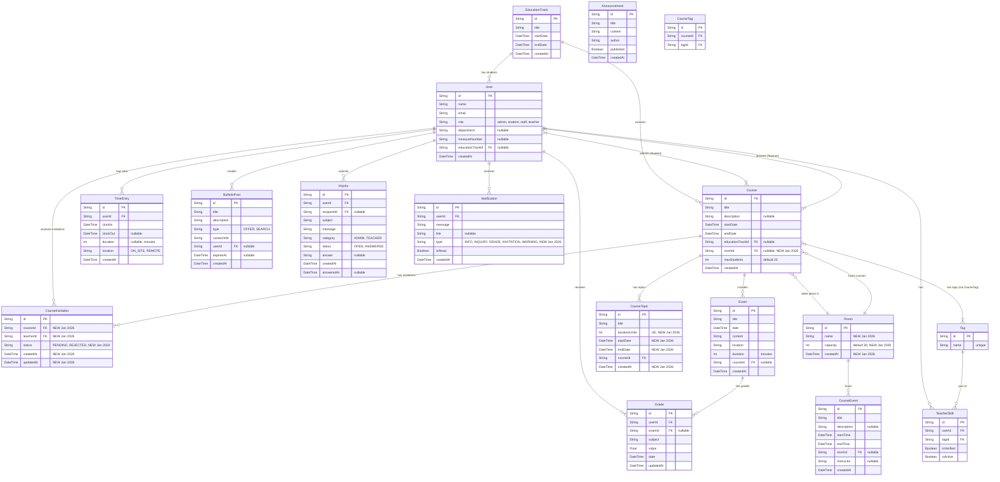

# Entity Plan & Database Schema Analysis

This document outlines the database schema for the Intranet application, detailing entities, their attributes, relationships, and user capabilities.

**Last Updated:** January 16, 2026

## Visual Representation (Mermaid)

## Recent Changes (January 2026)

### 🆕 New Entities
1. **Room** - Physical/virtual space management
2. **CourseInvitation** - Teacher invitation workflow
3. **CourseTopic** - Structured course content breakdown

### 🔄 Enhanced Entities
1. **Course** - Added `roomId` FK for location assignment
2. **Notification** - Added `type` field (5 types) and `link` for deep linking
3. **CourseTopic** - Added `startDate`, `endDate` for time planning

## Entity Descriptions

### 1. User
**Description**: Represents all actors in the system (Students, Teachers, Administrators, Staff).
**Attributes**:
*   `role`: Defines permissions (`admin`, `staff`, `teacher`, `student`).
*   `department`: For Admins/Staff (e.g., "IT-Support").
*   `measureNumber`: Specific ID for students (e.g., "123/456/2024").
*   `educationTrackId`: Links students to their specific cohort/year.
**Capabilities**:
*   **Admin**: Full CRUD. Manage Users, assign roles, verify skills.
*   **Staff**: Plan courses, assign teachers/students, manage schedules.
*   **Teacher**: View schedule, grade exams, manage own skills.
*   **Student**: View schedule, grades, clock in/out.

### 2. EducationTrack
**Description**: Represents a complete retraining program (e.g., "Fachinformatiker Winter 2025").
**Attributes**:
*   `startDate`, `endDate`: Duration of the entire program.
**Capabilities**:
*   **Staff**: Create and manage tracks.

### 3. Course (Module)
**Description**: A specific module within an EducationTrack (e.g., "Einführung Programmierung").
**Attributes**:
*   `maxStudents`: Limit for participants (default 25).
*   `topics`: Breakdown of content within the course.
*   `tags`: Links to `Tag` entity for skill matching.
**Capabilities**:
*   **Staff**: Create, assign teachers (with skill check) and students (max 25).

### 3. Course (Module)
**Description**: A specific module within an EducationTrack (e.g., "Einführung Programmierung").
**Attributes**:
*   `maxStudents`: Limit for participants (default 25).
*   `roomId`: **NEW (Jan 2026)** - Foreign key to Room entity for location assignment.
*   `topics`: Breakdown of content within the course via CourseTopic relation.
*   `tags`: Links to `Tag` entity for skill matching.
**Capabilities**:
*   **Staff**: Create, assign teachers (with skill check) and students (max 25), assign room.
*   **Teacher**: View course details, topics, and enrolled students.
*   **Student**: View course schedule, room location, and topics.

### 4. CourseTopic
**Description**: Granular topics within a course (e.g., "React Hooks" inside "Frontend Development").
**Attributes**:
*   `durationUnits`: Number of teaching units (UE).
*   `startDate`, `endDate`: **NEW (Jan 2026)** - Time planning for individual topics.
**Capabilities**:
*   **Staff**: Create, edit, delete topics within a course.
*   **Teacher**: View topic breakdown and schedule.
*   **System**: Calculate total UE per course (sum of all topic durationUnits).

### 5. Room
**Description**: **NEW ENTITY (Jan 2026)** - Physical or virtual spaces for instruction.
**Attributes**:
*   `capacity`: Max people (default 30).
*   `name`: e.g. "Raum 101", "Raum 102", "Remote", "Aula".
**Capabilities**:
*   **Admin/Staff**: Create and manage rooms.
*   **System**: Track room assignments for courses and events.
*   **All Users**: View room information in course details.

### 6. CourseInvitation
**Description**: **NEW ENTITY (Jan 2026)** - Manages teacher invitations to courses.
**Attributes**:
*   `status`: "PENDING" (waiting for response) or "REJECTED".
*   `courseId`, `teacherId`: Links invitation to specific course and teacher.
**Capabilities**:
*   **Staff**: Create invitations when assigning teachers to courses.
*   **Teacher**: Accept or reject course invitations.
*   **System**: Send INVITATION notifications when created.

### 7. TimeEntry
**Description**: Records of time spent working or studying (Time Tracking).
**Attributes**:
*   `location`: "ON_SITE" or "REMOTE".
*   `duration`: Calculated in minutes on clock-out.
**Capabilities**:
*   **Student/Staff**: Create (Clock In/Out).
*   **All**: Generate monthly log export.
*   **Staff**: View and manage time entries for all students.

### 8. Exam & Grade
**Description**: Assessment system.
**Attributes**:
*   `Exam`: Linked to a Course, includes duration (minutes), location, content.
*   `Grade`: Linked to User and Exam, float value (e.g., 1.3, 2.7).
**Capabilities**:
*   **Teacher**: Create exams, grade students via table view.
*   **Student**: View own grades and average calculation.
*   **System**: Send GRADE notifications when new grades are entered.

### 9. TeacherSkill
**Description**: Pivot table linking `User` (Teacher) to `Tag`.
**Attributes**:
*   `isVerified`: Boolean indicating if Admin has approved this skill.
*   `isActive`: Boolean for availability (teacher can toggle).
**Capabilities**:
*   **Teacher**: Request/Add skills, toggle active status.
*   **Admin**: Verify skills.
*   **Staff**: Use these tags to filter suitable teachers for course assignment.

### 10. Tag
**Description**: Universal label for skills and course requirements (e.g. "React", "JavaScript", "Accounting").
**Capabilities**:
*   Used for matching Course requirements with Teacher skills.
*   **Admin**: Create and manage tags.

### 11. Notification
**Description**: System notification for users with type-based categorization.
**Attributes**:
*   `type`: **ENHANCED (Jan 2026)** - 5 types: INFO, INQUIRY, GRADE, INVITATION, WARNING.
*   `link`: **NEW (Jan 2026)** - Deep link URL for navigation.
*   `isRead`: Boolean to track notification status.
**Capabilities**:
*   **System**: Auto-generate notifications for grades, invitations, warnings, inquiries.
*   **All Users**: View unread notifications, mark as read (auto on click).
*   **Students**: View notification history (excludes INQUIRY type).

### 12. BulletinPost
**Description**: Marketplace for "Search" and "Offer" posts.
**Attributes**:
*   `type`: "OFFER" or "SEARCH".
*   `expiresAt`: Optional expiration date.
*   `userId`: Nullable for guest posts.
**Capabilities**:
*   **All Users**: Create posts.
*   **Staff/Admin**: Delete posts with mandatory reason comment.
*   **System**: Send WARNING notification to author when post is deleted by staff.

### 13. Inquiry
**Description**: Communication channel for questions and support.
**Attributes**:
*   `category`: "ADMIN" or "TEACHER".
*   `status`: "OPEN" or "ANSWERED".
*   `recipientId`: **ENHANCED** - Specific staff member who answered.
*   `answer`: Staff response text.
**Capabilities**:
*   **Student**: Submit inquiries.
*   **Staff/Admin**: View, answer inquiries.
*   **System**: Send INQUIRY notification to staff, INFO notification to student when answered.

## Summary Statistics

**Total Entities:** 16
- Core: User, EducationTrack, Course, Exam, Grade
- Time & Attendance: TimeEntry
- Communication: Notification, Inquiry, BulletinPost
- Planning: CourseTopic, Room, CourseInvitation, CourseEvent
- Skills: Tag, TeacherSkill, CourseTag
- Legacy: Announcement

**New in January 2026:**
- 3 new entities (Room, CourseInvitation, enhanced CourseTopic)
- 2 enhanced entities (Notification with types, Course with roomId)
- Multiple new relationships and attributes
