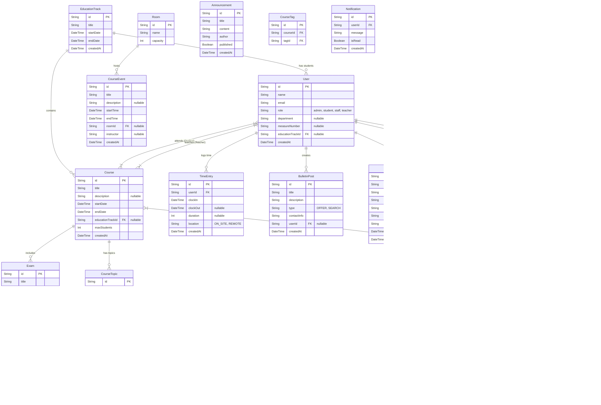

# Entity Plan & Database Schema Analysis

This document outlines the database schema for the Intranet application, detailing entities, their attributes, relationships, and user capabilities.

## Visual Representation (Mermaid)

## Entity Descriptions

### 1. User
**Description**: Represents all actors in the system (Students, Teachers, Administrators, Staff).
**Attributes**:
*   `role`: Defines permissions (`admin`, `staff`, `teacher`, `student`).
*   `department`: For Admins/Staff (e.g., "IT-Support").
*   `measureNumber`: Specific ID for students (e.g., "123/456/2024").
*   `educationTrackId`: Links students to their specific cohort/year.
**Capabilities**:
*   **Admin**: Full CRUD. Manage Users, assign roles, verify skills.
*   **Staff**: Plan courses, assign teachers/students, manage schedules.
*   **Teacher**: View schedule, grade exams, manage own skills.
*   **Student**: View schedule, grades, clock in/out.

### 2. EducationTrack
**Description**: Represents a complete retraining program (e.g., "Fachinformatiker Winter 2025").
**Attributes**:
*   `startDate`, `endDate`: Duration of the entire program.
**Capabilities**:
*   **Staff**: Create and manage tracks.

### 3. Course (Module)
**Description**: A specific module within an EducationTrack (e.g., "Einführung Programmierung").
**Attributes**:
*   `maxStudents`: Limit for participants (default 25).
*   `topics`: Breakdown of content within the course.
*   `tags`: Links to `Tag` entity for skill matching.
**Capabilities**:
*   **Staff**: Create, assign teachers (with skill check) and students (max 25).

### 4. CourseTopic
**Description**: Granular topics within a course (e.g., "Java Basics" inside "Programmierung").
**Attributes**:
*   `durationUnits`: Number of teaching units (UE).

### 5. Room
**Description**: Physical or virtual spaces for instruction.
**Attributes**:
*   `capacity`: Max people.
*   `name`: e.g. "Raum 101" or "Remote".

### 6. TimeEntry
**Description**: Records of time spent working or studying (Time Tracking).
**Attributes**:
*   `location`: "ON_SITE" or "REMOTE".
**Capabilities**:
*   **Student/Staff**: Create (Clock In/Out).
*   **All**: Generate monthly log export.

### 7. Exam & Grade
**Description**: Assessment system.
**Attributes**:
*   `Exam`: Linked to a Course.
*   `Grade`: Linked to User and Exam.
**Capabilities**:
*   **Teacher**: Grade students via table view.
*   **Student**: View own grades and average.

### 8. TeacherSkill
**Description**: Pivot table linking `User` (Teacher) to `Tag`.
**Attributes**:
*   `isVerified`: Boolean indicating if Admin has approved this skill.
*   `isActive`: Boolean for availability.
**Capabilities**:
*   **Teacher**: Request/Add skills.
*   **Admin**: Verify skills.
*   **Staff**: Use these tags to filter suitable teachers for course assignment.

### 9. Tag
**Description**: Universal label for skills and course requirements (e.g. "React", "Accounting").
**Capabilities**:
*   Used for matching Course requirements with Teacher skills.
